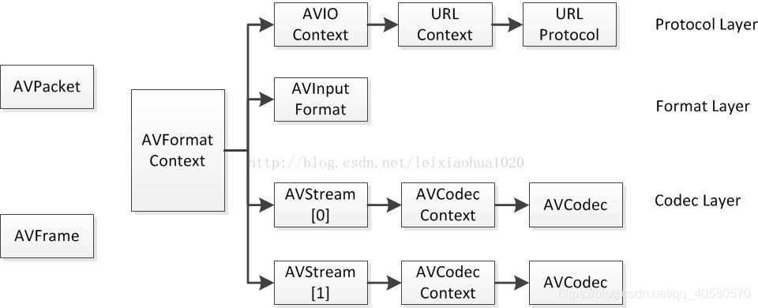

# 常见且重要的结构体

​		**ffmpeg中有很多结构体，偶尔使用此库的人会发现有一些结构体是经常遇到的，这些基本上也是ffmpeg中比较重要的结构体。在刚开始时可能不怎么理解这些结构体，不过没关系，先有个大概印象即可，在后面的编程过程中再细细体会。**

## `AVFrame`与`AVPacket`

`AVFrame`中存放着已经解码过的视频或者音频的原始数据。

`AVPacket`存放经过压缩过或编码过的数据。

## `AVCodec`与`AVCodecContext`

`AVCodec`在官方文档中没有解释，但是在我看来，`AVCodec`就是一个具体的解码器，针对某一种特定格式的解码器。

`AVCodecContext`在官方文档中同样没有解释，只是强调了是一个经常用到的结构体。我个人认为这个结构体包含了很多编解码器的参数或者说是各种编解码所需要的共同参数，这些参数只有在确定某一种编解码器或运行时才能确定，故称为编解码器的上下文。

## `AVStream`

`AVStream`在官方文档中仍然没有过多的解释，就一个句话，流结构体。什么意思呢，比如在一个媒体文件中，如电影大片，我们在观看的时候不仅可以看见画面，还可以听见声音，有的还有字幕等信息，这些从媒体文件中抽象出来就是一个个流。`AVStream`既可代表视频流，也可以代表音频流，同样可以代表字幕流。一般情况下，一个媒体文件中有多个流。

## `AVFormatContext`

很不幸，这个结构体同样在官方文档没有过多解析，也是一句话，格式IO上下文。也就是说，这个结构体可以处理各种媒体文件输入(读)输出(写)。比如你要打开一个媒体文件，就需要使用到这个结构体，同样如果要写入一个媒体文件，也需要这个结构体，除此之外，还有很多地方都使用到了这个结构。这个结构抽出了各种格式的公共部分，包含了许多参数，后续再详细了解。

最后引用一张雷神总结的图来大概看一下他们之间的关系：

