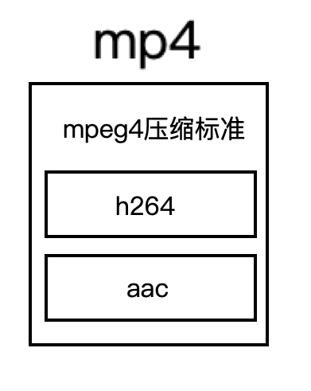

# 理清一些东西

ffmpeg是用于处理音视频的工具，其本质就是对各种流媒体协议，媒体文件的封装格式，数据的编码方式，像素的排列进行各种转换。为了更好的知道ffmpeg具体做了哪些工作，首先需要大概了解一下rtsp、rtmp、http是什么，mp4、mkv、avi是什么，h264、h265是什么，yuv420p、rbg24又是什么，以及它们之间的关系如何。

为什么会存在上述这些东西？一句话概括就是为了音视频数据更方便地存储与传输。这里暂且不讨论是如何方便存储与传输，先简单了解下上面的东西。

## mp4是什么

我们在windows系统上经常看见后缀是`mp4`，`mkv`的文件，我们知道这是一个视频文件，点击可以直接播放。但作为音视频开发人员，肯定是要知道它是由哪些构成的，或者说它的格式是什么样的。在音视频中，可以把mp4、mkv比喻成现实生活中的容器，比如碗，既可以盛水也可以盛饭，是用来装东西的。只不过在音视频中是装一定格式的视频音频这类信息，是一种文件格式，它在电脑上是一个完整的整体，可以复制到任何机器上直接运行打开，不需要其他任何处理(格式不支持暂不考虑)。如下图所示。

在一些地方可能还看见`mpeg4`这个东西，容易与`mp4`混淆。它们表达的意思是不同的，`mpeg4`是一个音视频的压缩标准，而`mp4`只是一个文件格式。`mp4`中的音视频信息可能是`mpeg4`的压缩标准，也可能不是。

## h264和aac是什么

`h264`一般指的是视频编码标准，其作用是将原始的图像信息进行编码，封装，目的是为了减小视频体积(视频是由一帧帧图像构成的，不进行编码体积会非常巨大)。`aac`是对音频进行编码的技术，目的与`h264`一样。一般媒体文件都会同时存在音频数据和视频数据。

## YUV420P是什么

在电脑上，图像可以用各种方式来表示，比如经常使用的彩色图像格式`rgb24`，由红绿蓝三个颜色组成，每个颜色占用一个字节，三个就是24字节，而灰度图像就只有一个字节表示像素的明亮程度，也有使用`yuv`来表示图像即亮度和色度，这个就有很多排列方式，`yuv420p`就是其中一个。**这个阶段的数据就是图像的原始数据，即没有压缩或编码的数据。经过压缩或编码之后就会形成如`h264`这样的视频流，在此之上进一步将视频和音频进行封装成文件格式就会成为像`mp4`这样的媒体文件。**

## RTSP是什么

当音视频需要在网络上传输并控制时，就需要这类东西进行封装，使其更好的在网络上进行传输。它不是简单地把一个文件拆分成小部分然后分别传输，而是直接传输的经过编码后的数据，比如`h264`视频流，并且可以实时进行控制，它是一个应用层的协议，定义了如何通过网络传输媒体数据。

