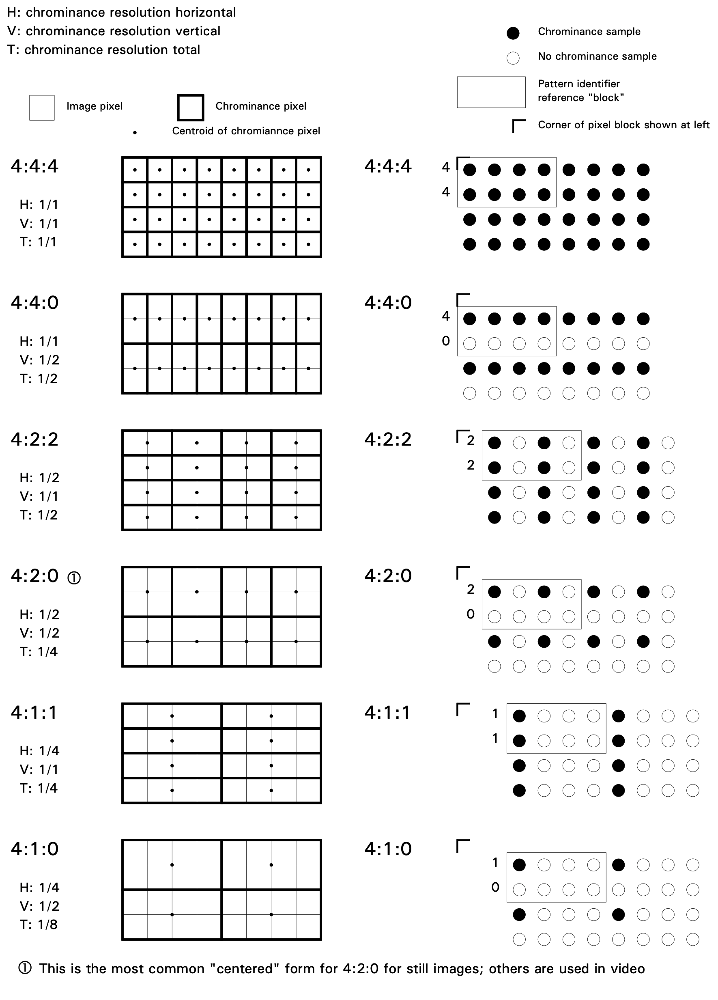

# 常见的图像像素格式

## RGB24

每个像素使用24比特来描述，即3个字节，在内存中的排列方式为`BGR BGR ... BGR`。如下图所示。


## RGB32

每个像素用32比特，占用4个字节，与`RGB24`不同的是最后一个字节是`alpha`通道，用来表示透明。排列方式与`RGB24`一样，为`BGRA BGRA ... BGRA`。也有A在最前面的，这些需要具体情况具体分析。

诸如还有类似`RGB555`，`RGB565`，后面的数字表示每个分量占用的比特位，比如`RGB555`表示R,G,B分别占用5位。

内存占用方式是使用一维数组来存储，如：`data[0]= r g b r g b r g b ...`。

## YUV

yuv是利用亮度和色度来描述像素的，其中y表示亮度值，uv表示色度值，也可以使用CbCr来表示。**注意，实际显示的时候还是使用RGB来显示的**，有一组转换公式。使用yuv格式比使用rgb格式在传输和存储时更能节省空间，所以可以理解为yuv是对rgb的压缩。

由于一副图像至少需要亮度，所以每一个像素必须包含y值，即亮度值或灰度值，而色度值则可以由几个像素来共用，从而达到减小体积的效果。

常见的有yuv444,yuv422,yuv420，后面的数字代表了几个像素共用uv，具体是如何对应的请参考https://blog.csdn.net/weixin_39820158/article/details/110000099

博客里面写的很详细。下一张图能很好解释数字的来历。



yuv在内存中的占用有两种方式，一种是平面格式(**Planar**)，另一种是打包格式(**Packed**)。

### Planar

平面格式是指使用三个数组分别存放yuv三个分量的值，比如data[0]存放y的数据，data[1]存放u的数据，data[2]存放v的数据。

例如：

```
data[0]=y0 y1 y2 y3 y4 ...
data[1]=u0 u1 u2 u3 u4 ...
data[2]=v0 v1 v2 v3 v4 ...
```

### Packed

打包格式是指使用一个数组表示yuv，其中每一组yuv是交替出现的。

例如：`data[0]=y0u0v0 y1u1v1 y2u2v2 ...`

## 参考文献

https://blog.csdn.net/byhook/article/details/84262330

https://zhuanlan.zhihu.com/p/85620611

https://blog.csdn.net/qq_45544223/article/details/107112766

